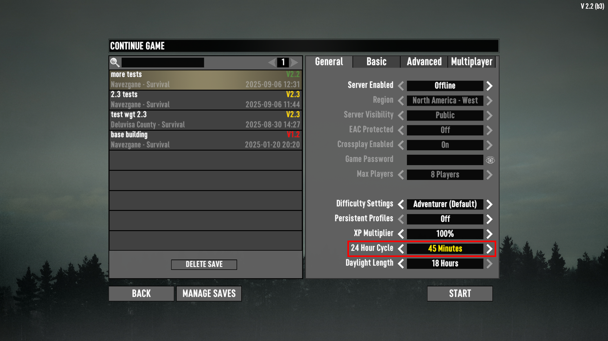

# ISI Minutes Per Day

Adds more options for the number of minutes per "24 Hour Cycle" xml`.
This builds off RyanFaeScotland's discovery of the rounding bug, to help set options that are within a minute or less of the expected time.

You can further tweak the options by setting the DayNightLength values in `/ISI_MinutesPerDay/Config/XUi_Menu/windows.xml`

## Screenshots

