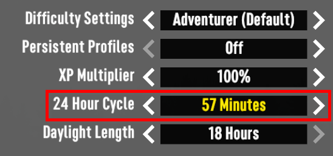
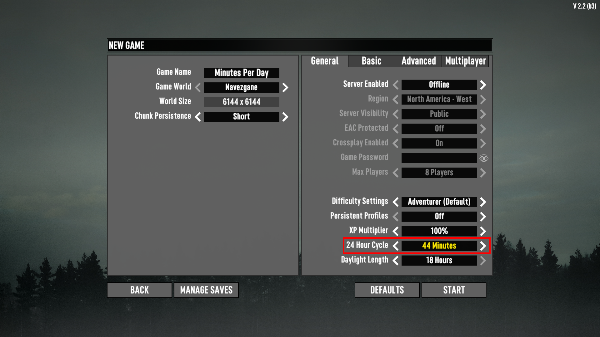

# ISI Minutes Per Day

If you ever set the "24 Hour Cycle" to 60 minutes, you may have noticed it actually takes 66 minutes, 90 minutes actually takes 100 minutes, and 120 minutes takes 133 minutes. This is due to a rounding error that RyanFaeScotland discovered.

This mod builds off that work to help set "24 Hour Cycle" options that are accurate to within a minute of real time. The below list is tailored to about 5 minute intervals, until the rounding makes that impossible.

> 1, 5, 10, 15, 20, 25, 30, 36, 40, 44, 50, 57, 66, 80, 100, 133, 200, 400

A more complete list is below. If you pick a number between any of these values, the game will round up to the next value. For example, if you try to set "24 Hour Cycle" to 45 minutes, it will actually take 50 minutes.

> 1, 2, 3, 4, 5, 6, 7, 8, 9, 10, 11, 12, 13, 14, 15, 16, 17, 18, 19, 20, 21, 22, 23, 25, 26, 28, 30, 33, 36, 40, 44, 50, 57, 66, 80, 100, 133, 200, 400

You can further tweak the options by changing the `DayNightLength` values in `/ISI_MinutesPerDay/Config/XUi_Menu/windows.xml`

## Screenshots

